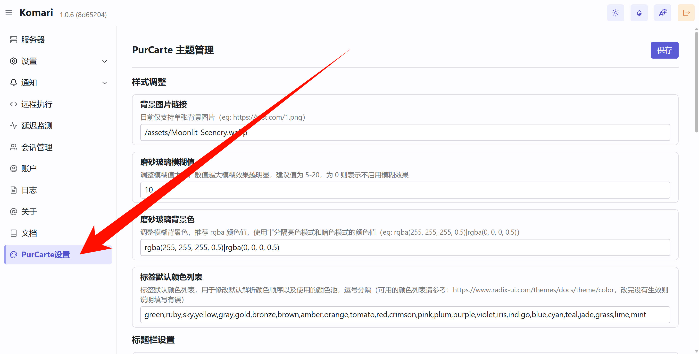

<div align="center">


## ✨ PurCarte ✨

一款为 [Komari](https://github.com/komari-monitor/komari) 设计的磨砂玻璃风格主题。

</div>

---

> [!NOTE]
> 本主题在 Gemini 的辅助下完成，融合了官方主题的部分设计与个人审美偏好，旨在提供一种简洁、美观的磨砂玻璃质感界面

## 🚀 快速开始

### 安装与启用

1.  前往 [Releases](https://github.com/Montia37/komari-theme-purcarte/releases) 页面下载最新的 `komari-theme-purcarte.zip` 文件。
2.  进入 Komari 后台，上传 `zip` 压缩包并启用本主题。

### 配置背景图片

> 为获得最佳视觉效果，建议搭配背景图片使用

#### Komari v1.0.5 及以上版本

如果 Komari 版本为 v1.0.5 或更高版本，可直接在 `Komari 后台 > PurCarte设置` 中配置背景图片等主题选项，无需手动添加自定义代码，如已添加自定义代码需要删去背景相关 style 避免干扰

#### 旧版本配置方法

<details>

对于旧版本，请在 `Komari 后台 > 设置 > 站点 > 自定义 Body` 处添加以下代码并保存：

```html
<style>
  /* 自定义背景图片 */
  body::before {
    content: "";
    position: fixed;
    top: 0;
    left: 0;
    width: 100%;
    height: 100%;
    z-index: -1;
    background: url(https://i.yon.li/w/682f73d97eade.png) center/cover no-repeat;
  }
</style>
```

</details>

## ⚙️ 主题配置



本主题支持通过 Komari 后台进行详细配置，所有可用选项如下：

#### 样式调整

- **主要内容宽度** (`mainWidth`)
  - **类型:** `number`
  - **默认值:** `85`
  - **说明:** 调整主要内容的最大宽度，单位为视口宽度的百分比（vw），建议值为 80-90

- **桌面端背景图片链接** (`backgroundImage`)
  - **类型:** `string`
  - **默认值:** `/assets/Moonlit-Scenery.webp`
  - **说明:** 目前支持单张背景图片或图片api，使用“|”分隔亮色模式和暗色模式，填写单个则同时用于亮暗模式，请自行测试（eg: `https://test.com/1.png`）

- **移动端背景图片链接** (`backgroundImageMobile`)
  - **类型:** `string`
  - **默认值:** `(空)`
  - **说明:** 移动端背景图片链接，与桌面端一样区分亮暗模式，留空则使用桌面端背景

- **启用视频背景** (`enableVideoBackground`)
  - **类型:** `switch`
  - **默认值:** `false`
  - **说明:** 启用后将使用视频作为背景

- **桌面端视频背景链接** (`videoBackgroundUrl`)
  - **类型:** `string`
  - **默认值:** `/assets/LanternRivers_1080p15fps2Mbps3s.mp4`
  - **说明:** 视频背景链接（eg: `https://test.com/1.mp4`），使用“|”分隔亮色模式和暗色模式，填写单个则同时用于亮暗模式，建议使用无声视频，且视频文件较大时可能会影响加载速度

- **移动端视频背景链接** (`videoBackgroundUrlMobile`)
  - **类型:** `string`
  - **默认值:** `(空)`
  - **说明:** 移动端视频背景链接，与桌面端一样区分亮暗模式，留空则使用桌面端视频

- **启用磨砂玻璃效果** (`enableBlur`)
  - **类型:** `switch`
  - **默认值:** `true`
  - **说明:** 启用后将使主要容器拥有磨砂玻璃效果

- **磨砂玻璃模糊值** (`blurValue`)
  - **类型:** `number`
  - **默认值:** `10`
  - **说明:** 调整模糊值大小，数值越大模糊效果越明显，建议值为 5-20，为 0 则表示不启用模糊效果

- **磨砂玻璃背景色** (`blurBackgroundColor`)
  - **类型:** `string`
  - **默认值:** `rgba(255, 255, 255, 0.5)|rgba(0, 0, 0, 0.5)`
  - **说明:** 调整模糊背景色，推荐 rgba 颜色值（eg: rgba(255, 255, 255, 0.5)|rgba(0, 0, 0, 0.5)），使用“|”分隔亮色模式和暗色模式的颜色值，填写单个则同时用于亮暗模式

- **启用标签透明背景** (`enableTransparentTags`)
  - **类型:** `switch`
  - **默认值:** `true`
  - **说明:** 启用后标签将使用较为透明的背景色，当背景情况复杂导致标签难以辨识时建议关闭

- **标签默认颜色列表** (`tagDefaultColorList`)
  - **类型:** `string`
  - **默认值:** `ruby,gray,gold,bronze,brown,yellow,amber,orange,tomato,red`
  - **说明:** 标签默认颜色列表，展示的标签将按顺序调用该颜色池，逗号分隔（可用的颜色列表请参考：[Radix Color](https://www.radix-ui.com/themes/docs/theme/color)，改完没有生效则说明填写有误）

- **默认主题颜色** (`selectThemeColor`)
  - **类型:** `select`
  - **默认值:** `violet`
  - **说明:** 设置默认主题颜色，颜色对照请参考：[Radix Color](https://www.radix-ui.com/themes/docs/theme/color)

#### 浏览器本地存储配置

- **启用 localStorage 配置** (`enableLocalStorage`)
  - **类型:** `switch`
  - **默认值:** `true`
  - **说明:** 启用后将优先使用用户浏览器本地配置的视图和外观设置。关闭后将强制使用下方的主题配置，本地可调整但刷新即恢复

- **默认展示视图** (`selectedDefaultView`)
  - **类型:** `select`
  - **默认值:** `grid`
  - **说明:** 设置默认展示视图为网格或表格

- **默认外观** (`selectedDefaultAppearance`)
  - **类型:** `select`
  - **默认值:** `system`
  - **说明:** 设置默认外观为浅色、深色或系统主题

- **状态卡片显示控制** (`statusCardsVisibility`)
  - **类型:** `string`
  - **默认值:** `currentTime:true,currentOnline:true,regionOverview:true,trafficOverview:true,networkSpeed:true`
  - **说明:** 控制状态卡片的显示与隐藏，格式为 卡片名称:显示状态（true/false），多个卡片使用逗号分隔，支持的卡片名称包括 currentTime（当前时间）, currentOnline（当前在线）, regionOverview（点亮地区）, trafficOverview（流量概览）, networkSpeed（网络速率）

#### 标题栏设置

- **启用标题栏左侧 Logo** (`enableLogo`)
  - **类型:** `switch`
  - **默认值:** `false`
  - **说明:** 启用后默认在标题栏左侧显示 Logo

- **Logo 图片链接** (`logoUrl`)
  - **类型:** `string`
  - **默认值:** `/assets/logo.png`
  - **说明:** Logo 图片链接（eg: `https://test.com/logo.png`）

- **启用标题栏标题** (`enableTitle`)
  - **类型:** `switch`
  - **默认值:** `true`
  - **说明:** 启用后默认在顶栏左侧显示标题

- **标题栏标题文本** (`titleText`)
  - **类型:** `string`
  - **默认值:** `(空)`
  - **说明:** 标题栏左侧显示的文本（留空则使用站点标题）

- **启用搜索按钮** (`enableSearchButton`)
  - **类型:** `switch`
  - **默认值:** `true`
  - **说明:** 启用后默认在标题栏右侧显示搜索按钮

- **启用管理按钮** (`enableAdminButton`)
  - **类型:** `switch`
  - **默认值:** `true`
  - **说明:** 启用后默认在标题栏右侧显示管理按钮

#### 内容设置

- **启用 JSON-RPC2 API 适配（实验性，未完全支持特性）** (`enableJsonRPC2Api`)
  - **类型:** `switch`
  - **默认值:** `false`
  - **说明:** 启用后将在支持的 Komari 版本（>=1.0.7）优先使用 JSON-RPC2 API 获取数据，以提升兼容性和性能，若出现问题请关闭此选项

- **是否在标题栏中显示统计信息** (`isShowStatsInHeader`)
  - **类型:** `switch`
  - **默认值:** `false`
  - **说明:** 启用后将在标题栏中显示统计信息，仅在大屏桌面端有效，当标题栏空间不足时将恢复原统计栏位置

- **合并分组栏与统计栏** (`mergeGroupsWithStats`)
  - **类型:** `switch`
  - **默认值:** `false`
  - **说明:** 启用后分组栏将合并到统计栏中，并以下拉菜单形式展示

- **启用统计栏** (`enableStatsBar`)
  - **类型:** `switch`
  - **默认值:** `true`
  - **说明:** 启用后默认显示统计栏

- **启用排序控制** (`enableSortControl`)
  - **类型:** `switch`
  - **默认值:** `false`
  - **说明:** 启用后在统计栏添加排序控制下拉菜单选项，分别对流量上下行和网速上下行进行升降排序，仅在启用统计栏时有效

- **启用分组栏** (`enableGroupedBar`)
  - **类型:** `switch`
  - **默认值:** `true`
  - **说明:** 启用后默认显示分组栏

- **启用 SWAP 显示** (`enableSwap`)
  - **类型:** `switch`
  - **默认值:** `true`
  - **说明:** 启用后默认显示 SWAP 信息

- **预览详情的延迟图表时间范围** (`pingChartTimeInPreview`)
  - **类型:** `number`
  - **默认值:** `1`
  - **说明:** 设置卡片右上角弹窗详情和表格下拉详情中延迟图表的时间范围，单位为小时，建议值为 1-24，时间范围太大容易导致页面卡顿

- **是否在卡片中显示硬件信息栏** (`isShowHWBarInCard`)
  - **类型:** `switch`
  - **默认值:** `true`
  - **说明:** 启用后将在节点卡片中标题栏之下显示硬件信息栏（CPU、内存和硬盘总量）

- **是否在流量进度条下方显示数值** (`isShowValueUnderProgressBar`)
  - **类型:** `switch`
  - **默认值:** `false`
  - **说明:** 启用后将在内存、SWAP、硬盘占用情况进度条下方显示实际占用数值

- **流量进度条样式** (`selectTrafficProgressStyle`)
  - **类型:** `select`
  - **默认值:** `circular`
  - **说明:** 设置流量进度条样式为 circular（环形）或 linear（线形）

- **启用列表视图进度条** (`enableListItemProgressBar`)
  - **类型:** `switch`
  - **默认值:** `true`
  - **说明:** 启用后列表视图中将会显示进度条来表示使用率

#### Instance 设置

- **启用 Instance 详情信息** (`enableInstanceDetail`)
  - **类型:** `switch`
  - **默认值:** `true`
  - **说明:** 启用后默认显示 Instance 详情

- **启用延迟图表** (`enablePingChart`)
  - **类型:** `switch`
  - **默认值:** `true`
  - **说明:** 启用后默认显示延迟图表

- **启用连接断点** (`enableConnectBreaks`)
  - **类型:** `switch`
  - **默认值:** `false`
  - **说明:** 启用后图表中的曲线将会跨过断点形成连续的线条，并使用半透明的垂直参考线来标记断点位置

- **延迟图表最大渲染点数** (`pingChartMaxPoints`)
  - **类型:** `number`
  - **默认值:** `0`
  - **说明:** 设置延迟图表的最大渲染点数来优化图表渲染，0 表示不限制，推荐值为 2000 或更小的值

## 🛠️ 本地开发

1.  **克隆仓库**

    ```bash
    git clone https://github.com/Montia37/komari-theme-purcarte.git
    cd komari-theme-purcarte
    ```

2.  **安装依赖**

    ```bash
    yarn install
    ```

3.  **启动开发服务器**

    ```bash
    yarn dev
    ```

4.  在浏览器中打开 `http://localhost:5173` (或 Vite 提示的其他端口) 即可进行预览和调试。

## 📄 许可证

本项目采用 [MIT License](LICENSE) 授权。
